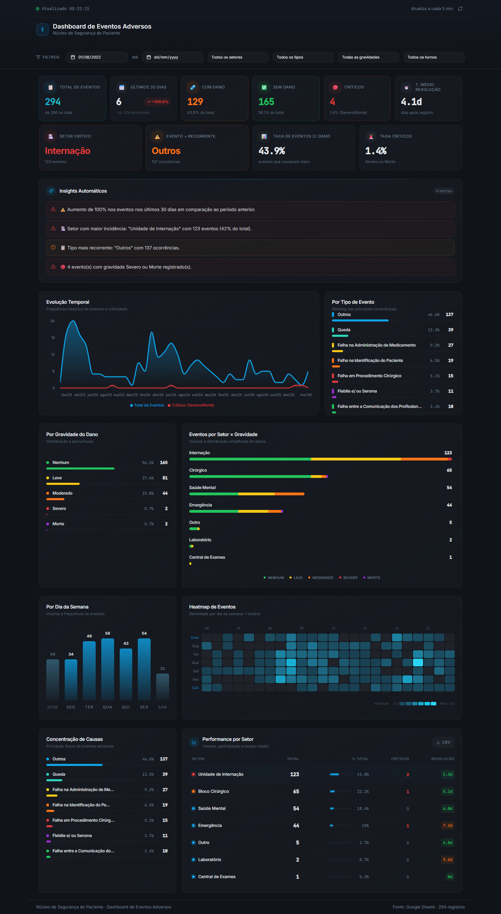

<div align="center">

# 🏥 Dashboard de Eventos Adversos

### Núcleo de Segurança do Paciente

Plataforma de monitoramento e análise de eventos adversos hospitalares em tempo real, com integração direta ao Google Sheets e visualizações interativas para suporte à tomada de decisão clínica.

[](https://react.dev)
[](https://www.typescriptlang.org)
[](https://vitejs.dev)
[](https://tailwindcss.com)
[](https://ui.shadcn.com)

</div>

---

## 📸 Preview

<div align="center">



</div>

---

## ✨ Funcionalidades

| Categoria | Descrição |
|---|---|
| 📊 **KPIs em Tempo Real** | Total de eventos, eventos com/sem dano, críticos, tempo médio de resolução |
| 🔔 **Insights Automáticos** | Alertas inteligentes sobre tendências, setores críticos e gravidades |
| 📈 **Evolução Temporal** | Gráfico de linha com histórico de eventos e casos críticos ao longo do tempo |
| 🏷️ **Análise por Tipo** | Ranking dos tipos de eventos mais recorrentes com percentuais |
| ⚠️ **Gravidade do Dano** | Distribuição por níveis (Nenhum, Leve, Moderado, Severo, Morte) |
| 🏢 **Eventos por Setor** | Gráfico de barras empilhadas com distribuição de gravidade por setor |
| 📅 **Análise por Dia da Semana** | Volume de eventos distribuídos por dia |
| 🗺️ **Heatmap de Eventos** | Mapa de calor cruzando dia da semana × horário |
| 🎯 **Concentração de Causas** | Pareto dos principais focos de eventos adversos |
| 📋 **Performance por Setor** | Tabela detalhada com volume, % do total, críticos e tempo de resolução |
| 🔄 **Atualização Automática** | Dados atualizados a cada 5 minutos via Google Sheets |
| 🎛️ **Filtros Avançados** | Filtro por período, setor, tipo, gravidade e turno |

---

## 🛠️ Tecnologias

- **Framework:** React 18 + TypeScript
- **Build Tool:** Vite 5
- **Estilização:** Tailwind CSS 3 + shadcn/ui
- **Gráficos:** Recharts
- **Gerenciamento de Estado:** TanStack React Query
- **Roteamento:** React Router DOM
- **Fonte de Dados:** Google Sheets (via API pública)

---

## 🚀 Como Executar

### Pré-requisitos

- [Node.js](https://nodejs.org/) (v18 ou superior)
- npm, yarn ou bun

### Instalação

```bash
# Clone o repositório
git clone https://github.com/KaelBittencourt/dashboard-evento-adverso.git

# Entre no diretório do projeto
cd dashboard-evento-adverso

# Instale as dependências
npm install

# Inicie o servidor de desenvolvimento
npm run dev
```

O dashboard estará disponível em `http://localhost:8080`.

---

## 📁 Estrutura do Projeto

```
dashboard-evento-adverso/
├── public/                  # Arquivos estáticos
├── src/
│   ├── components/
│   │   ├── dashboard/       # Componentes do dashboard (gráficos, KPIs, filtros)
│   │   └── ui/              # Componentes base (shadcn/ui)
│   ├── hooks/               # Hooks customizados (fetch de dados, filtros)
│   ├── lib/                 # Utilitários e helpers
│   ├── pages/               # Páginas da aplicação
│   ├── App.tsx              # Componente raiz com rotas
│   └── main.tsx             # Ponto de entrada
├── index.html               # Template HTML
├── tailwind.config.ts       # Configuração do Tailwind
├── vite.config.ts           # Configuração do Vite
└── package.json             # Dependências e scripts
```

---

## 📜 Scripts Disponíveis

| Comando | Descrição |
|---|---|
| `npm run dev` | Inicia o servidor de desenvolvimento |
| `npm run build` | Gera o build de produção |
| `npm run preview` | Visualiza o build de produção |
| `npm run lint` | Executa o ESLint |
| `npm run test` | Executa os testes unitários |

---

## 📄 Licença

Este projeto é de uso privado e proprietário.

---

<div align="center">

Desenvolvido com 💙 para o **Núcleo de Segurança do Paciente**

</div>
